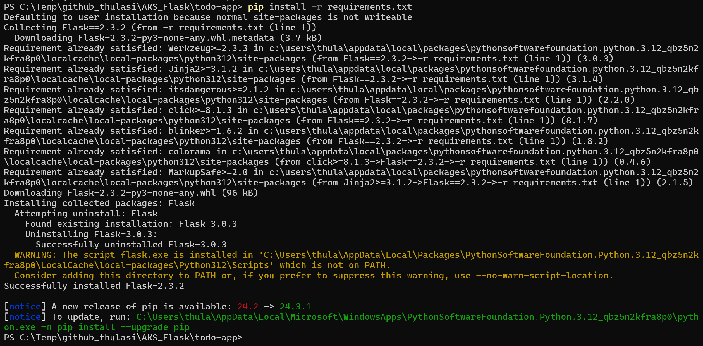
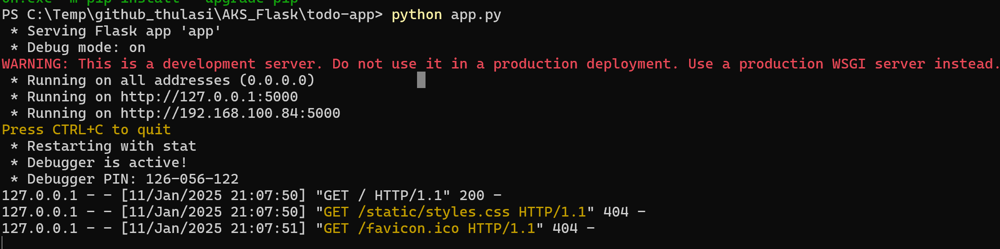
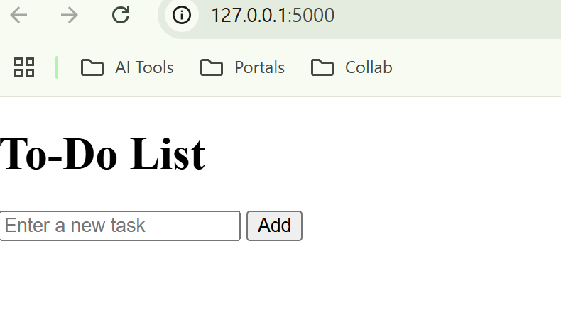
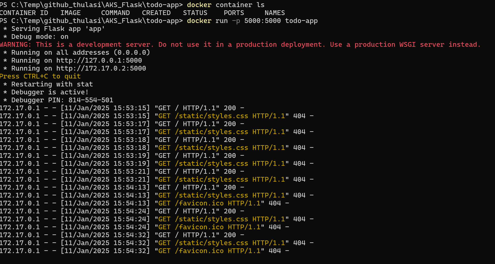
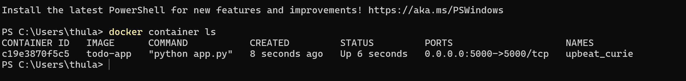
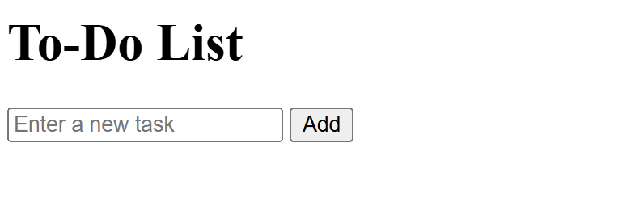

# **To-Do List Application**

## **Overview**

This is a simple To-Do List web application built using **Flask**, a lightweight Python web framework. The application provides basic **CRUD (Create, Read, Update, Delete)** operations to manage tasks in a user-friendly interface. It serves as a foundational project to understand how Flask can be used to build and deploy web applications.

---

## **Features**

- Add new tasks to the To-Do list.
- Update existing tasks.
- Delete tasks from the list.
- User-friendly web interface styled with CSS.
- Fully containerized with Docker for easy deployment.

---

## **Tech Stack**

- **Frontend:** HTML, CSS (basic styling)
- **Backend:** Python with Flask framework
- **Containerization:** Docker
- **Deployment:** Azure Kubernetes Service (AKS)

---

# **What is Docker?**

Docker is a powerful **containerization platform** that allows developers to package their applications and all their dependencies into a single, portable unit called a **container**. Containers ensure that applications run consistently across different environments, eliminating compatibility issues.

---

## **Docker Explained**

### **In Simple Terms**
Imagine you want to cook your favorite dish at a friend’s house. If you carry a kit with all the required ingredients, utensils, and the recipe, you can make the dish exactly the same way, no matter where you are. 

Docker works the same way for applications. It packages the application along with everything it needs—libraries, tools, and configurations—into a container, so it runs the same way on any computer.

---

### **In Technical Terms**
Docker is

## **Folder Structure**

## local environment setup

1. install python
2. create local folder structure

3. install pip dependencies ( like flask )

check if application is hosted locally

2. to setup docker image

running using docker container

exposed to the port 5000

1.local environment
2. docker container
3. kubernetes
